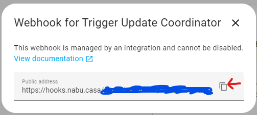
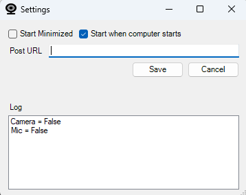

# WebCamMicMonitor

This project was born out of the need to know when I was in meetings, and wanted it to work no mater the confernce software being used. 

WebCamMicMonitor monitors the registry keys that are updated anytime an app uses the mic or webcam, and then posts a JSon package to the configured URL.

I use Home Assistant for my needs, but you could use anything that can accept a HTTP Post with a Json Payload, as such the steps below will be Home Assistant focused.


# Data passed in the HTTP Post
{
  mic: boolean,
  camera: boolean
}

This allows for the recieve to know the status of the mic/camera, and perform actions when the values change.

# Create sensors in Home Assistant 

Below defines the webhook, and three sensors.
The Active Meeting sensor is true if either the mic or camera is in use and false if neither are in use. 

- Add the following to your configuration.yaml
```
template:
  - trigger:
      - platform: webhook
        webhook_id: CameraMicStatus
        local_only: false

    binary_sensor:
      - name: "DevBoxCamera"
        state: "{{ trigger.json.camera }}"

      - name: "DevBoxMic"
        state: "{{ trigger.json.mic }}"

  - binary_sensor:
      - name: Active Meeting
        state: "{{ is_state('binary_sensor.devboxmic', 'on') or is_state('binary_sensor.devboxcamera', 'on') }}"

```

- Once Added restart home assistant. **Note:**  I have not tried to just reload, as restarting for me only takes a few seconds
 
- The following automation ensures office light is on when in meeting (mic or camera in use)
 


# Set up WebCamMicMonitor

In home asssitant:
- Navigate to the web hooks
  - Settings --> Home Assistant Cloud --> Webhooks at bottom of page
- Click Manage for the CameraMicStatus 
- Click copy icon next to the URL (you'll need this in the next steps)

- Run WebCamMicMonitor and you will be presented with the settings screen:

- Paste the URL copied in previous step into the Post URL.
- Set your preference for auto start and minimized
- click OK

At this point if you use your webcam or mic you should see in the log the change in status and the automation as defined above trigger when the webcam or mic go from not in use to in use.

**Remember if you're using Nabu.casa to keep your web hooks private as they are accessible to anyone with the link**


